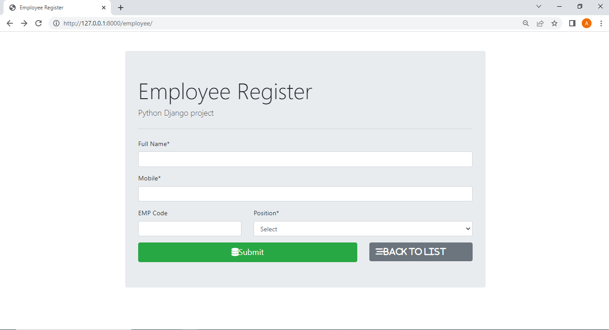
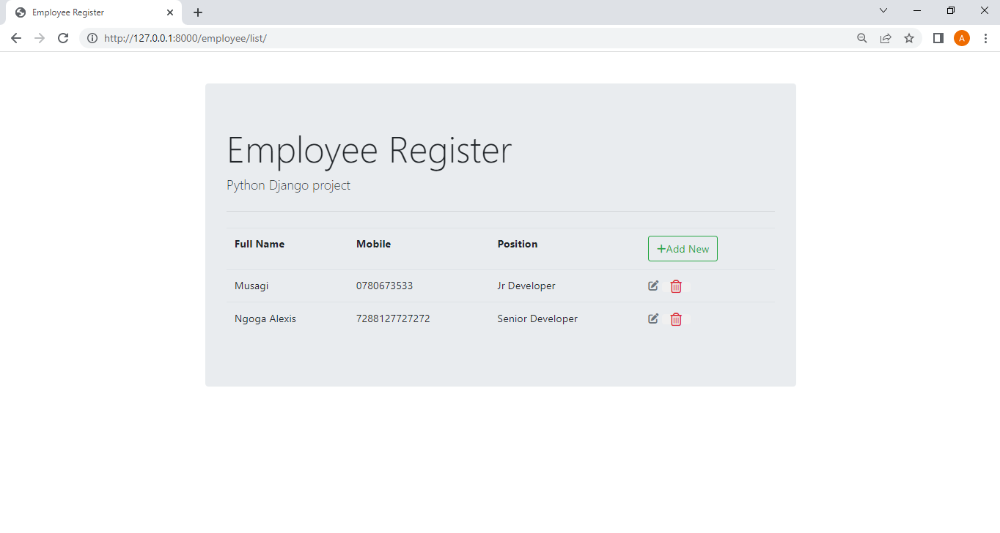

# Employee_Registry
Employee registry management using Django

- you can register employee
- remove employee
- update employee
- View all registered employees

## Requirements

- Web browser: Chrome, or Firefox...
- IDE: Vs code
- Database: Mysql

### Tasks, Checklist

- [x] Database structure
- [x] GUI design, layout
- [x] CRUD operations
